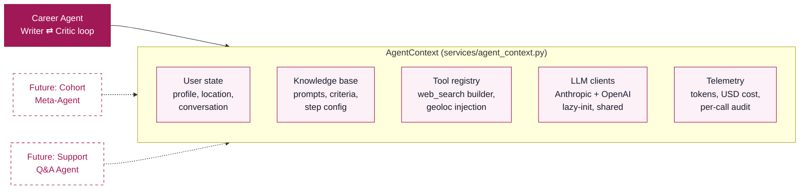
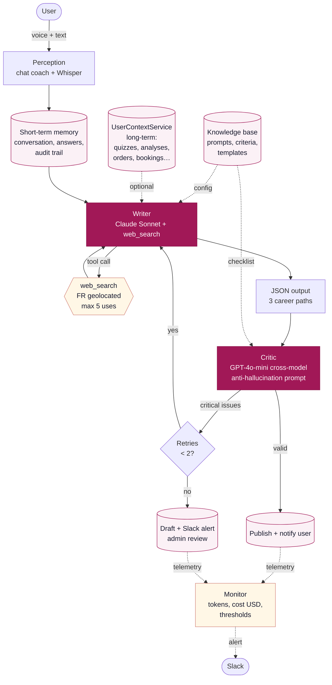

# Tilto

> AI-powered career reorientation, grounded in your local job market.

Career change is paralyzing — generic online tests give vague advice and human coaches are expensive. **Tilto** is a French AI agent platform that interviews you in 5 minutes, queries the live job market in your region, and delivers 3 personalized career paths in under 90 seconds — with an independent cross-model critic loop that gates quality before you see anything.

## What you get

A 5-minute conversational interview produces a structured deliverable backed by **real-time market data**:

- **3 career paths**, each with: precise job title, daily reality, "why this fits you", required formation duration, salary range, and a verified market stat for your region.
- **A diagnostic** that quotes your own words and explains where you stand.
- **A personalized advice section** explaining your blind spots and what to do next.

<details>
<summary>Sample output (truncated)</summary>

```json
{
  "welcome": {
    "quote_verbatim": "Je passe mes journées en réunions sans voir l'impact concret de ce que je fais...",
    "comprends_text": "Tu cherches du <em>sens</em>, de l'<em>impact concret</em> et de la <em>création</em>...",
    "point_important": "Tu n'es pas blasé du marketing — tu es frustré parce que ton talent..."
  },
  "pistes": [
    {
      "icon": "💡",
      "option_title": "L'option Impact Direct",
      "job_title": "Responsable Communication et Plaidoyer (association santé/éducation)",
      "quelques_mots": "Tu pilotes la stratégie de communication d'une association à taille humaine...",
      "pourquoi": "Tu as 8 ans d'expérience en marketing produit et tu sais piloter de A à Z...",
      "tags": ["Sens immédiat", "Storytelling", "Lien humain"],
      "formation_duree": "1-2 mois",
      "salaire": "2800-3800€ net",
      "stat_marche": "Plus de 120 offres en communication associative publiées en Île-de-France ces 3 derniers mois"
    }
  ]
}
```
</details>

**Median performance per analysis:** ~90s end-to-end · 4 LLM calls (Anthropic + OpenAI) · up to 5 geolocated web searches · 1-2 critic passes · ~$0.15 per job.

## Agent capabilities

The career agent is built around 7 traits, each with concrete implementation:

| Trait | Implementation |
|---|---|
| **Perception** | Conversational coach (`services/conversation_eval_service.py`) + audio transcribed via Whisper (`services/audio_service.py`) |
| **Short-term memory** | Audit trail of conversation, answers, prompts and retries (`quiz_user`, `answer_user`, `prompt_user`, `analysis_validation_logs`) |
| **Knowledge base** | Editable config in DB: system prompts, instructions, knowledge texts, validation checklists (`quiz_result.*`) — tunable without deployment |
| **Tool use** | Anthropic `web_search_20250305` with FR geolocation injected from the user's city — the agent queries the real job market while writing |
| **Action** | Structured JSON deliverable: 3 career paths with salary ranges, regional market stats, formation duration, personalized rationale |
| **Self-correction** | Cross-model **Writer ⇄ Critic** loop. Writer retries with critic feedback up to 2 times. |
| **Convergence** | Auto-publish if validation succeeds; draft + Slack admin alert if retries exhausted |

## Agent context layer

All agents in Tilto consume a shared `AgentContext` (`services/agent_context.py`) — a single entry point that bundles **session state**, **knowledge base**, **tools**, **LLM clients**, **telemetry**, and a lazy bridge to the **long-term user context**. This is the spine that prevents the "bazaar of disconnected agents" problem as the system grows.

Two complementary layers:

| Layer | Lifetime | Purpose |
|---|---|---|
| **`AgentContext`** (per-job) | ~90s, one instance per agent run | Session state (location, conversation), knowledge base, tools, telemetry |
| **`UserContextService`** (long-term) | Persisted across sessions and agents | 360° view of a user: quizzes, analyses, orders, bookings, capsule listens, chat messages, consent history |

A future agent (support, follow-up, meta-analyser) reads `ctx.get_user_summary()` or `ctx.user_context_service.get_full_context()` and instantly knows *who this user is across their entire journey*. The `UserContextService` powers both the admin user-detail page and any agent that needs durable context.



**Why a context layer matters.** Most agentic codebases that started with one agent end up with N agents that:
- Each fetch user data from DB in their own way (drift in formats)
- Duplicate token-tracking and cost-logging logic
- Instantiate their own LLM clients (no shared rate limit awareness)
- Hardcode prompts instead of reading them from a knowledge base

The `AgentContext` solves this by being the **single source of truth per job**. New agents implement one method (their core logic) and consume the context for everything else. See the docstring at the top of `services/agent_context.py` for the full rationale.

## Agent architecture

The career agent is implemented in `services/quiz_analysis_service.py` as a `QuizAnalysisService` class — one instance per job, consuming an `AgentContext`.



### Code map (Writer ⇄ Critic)

| Method | Role |
|---|---|
| `_writer_call(...)` | Calls Anthropic Claude with `web_search`; tracks token usage |
| `_writer_retry_with_feedback(...)` | Regenerates targeted parts using the critic's issues |
| `_critic_call(...)` | Calls OpenAI for cross-model validation (Anthropic fallback) |
| `_critic_evaluate(...)` | Orchestrates one validation cycle (build prompt → call critic → parse issues) |
| `_track_usage(...)` | Per-call telemetry: input/output tokens, web_search uses, USD cost |
| `get_usage_summary()` | Job-level total for monitoring and Slack alerts |
| `ctx.user_context_service` | Lazy access to long-term user context (history, orders, bookings) |
| `ctx.get_user_summary()` | Condensed snapshot of the user across all sessions |

### Telemetry & alerting

Every LLM call captures `input_tokens`, `output_tokens`, web search invocations, and computes USD cost via the `LLM_PRICING` table at the top of `quiz_analysis_service.py`. At job end, `services/async_analysis_service.py` logs a `[USAGE-SUMMARY]` line and emits a Slack alert if any threshold is breached:

| Threshold | Default | Override |
|---|---|---|
| Cost per job | $1.00 | `USAGE_ALERT_COST_USD` |
| Total duration | 180s | `USAGE_ALERT_DURATION_S` |
| Retries reached max | 2 | `USAGE_ALERT_RETRIES` |

### Switching the critic provider

```bash
VALIDATOR_PROVIDER=openai             # or "anthropic" to fall back to self-validation
OPENAI_VALIDATOR_MODEL=gpt-4o-mini    # or "gpt-4o" for stricter validation
```

The critic provider used is captured per-call in `prompt_user.api_params.provider`, enabling A/B analysis of validator performance over time.

## Tech stack

| Layer | Technology |
|---|---|
| **Agent — Writer** | Anthropic Claude Sonnet 4.5 + `web_search_20250305` tool |
| **Agent — Critic** | OpenAI GPT-4o-mini (configurable to `gpt-4o`, or fall back to Anthropic) |
| **Agent — Audio** | OpenAI Whisper for speech-to-text |
| Backend | Flask 2.2.5, Python 3.10, Gunicorn |
| Database | MySQL (Flask-MySQLdb, SQLAlchemy) |
| Frontend | Jinja2, HTML/CSS/JS, Flask-Assets |
| Async runtime | Google Cloud Tasks (prod) / threads (dev) |
| Cloud | GCP — Cloud Run, Cloud SQL, Cloud Storage, Secret Manager |
| Payments | Stripe |
| Email | Brevo |
| Monitoring | OpenTelemetry, Google Cloud Logging, Slack alerts |

## Getting started

### Prerequisites

- Python 3.10+
- MySQL database
- API keys: **Anthropic** (writer + tool use), **OpenAI** (critic + audio). Optional: Stripe, Brevo, Slack.

### Installation

```bash
git clone <repo-url>
cd tilto

python -m venv venv
source venv/bin/activate

pip install -r requirements.txt
```

### Configuration

Create a `.env` file with the required keys:

```env
# Database
DB_HOST=localhost
DB_PORT=3306
DB_NAME=tilto
DB_USER=your_db_user
DB_PASSWORD=your_db_password

# Flask
SECRET_KEY=your_secret_key

# Agent — Writer
ANTHROPIC_API_KEY=your_anthropic_key
ANTHROPIC_MODEL=claude-sonnet-4-5-20250929
ENABLE_WEB_SEARCH=true

# Agent — Critic & audio
OPENAI_API_KEY=your_openai_key
VALIDATOR_PROVIDER=openai
OPENAI_VALIDATOR_MODEL=gpt-4o-mini
```

Optional keys for Stripe, Brevo, Google Cloud, Slack, YouCanBookMe, anonymization and analytics — all listed in `config.py`.

### Run locally

```bash
flask run                                                      # dev
gunicorn wsgi:application --workers 2 --threads 4 --bind 0.0.0.0:8080   # prod-like
```

### Test the agent end-to-end

In dev only, you can skip the voice flow and inject a known-good 4-turn conversation. Open the homepage chat, then in browser DevTools console:

```js
QuizChat.devSkip()
```

Gated on `localhost` / `127.0.0.1`. Triggers the same lead capture → analysis pipeline as a real user. Watch server logs for `[USAGE]`, `[USAGE-SUMMARY]` and validation traces.

### Docker & deploy

```bash
docker build -t tilto:latest .
docker run -p 8080:8080 -e ANTHROPIC_API_KEY=... -e OPENAI_API_KEY=... tilto:latest

# GCP deploy
gcloud builds submit --config cloudbuild.yaml
```

In production, secrets live in Google Secret Manager (`APP_CONFIG`), and the async analysis runs on Cloud Tasks instead of in-process threads — so the agent can take 60-90s without holding HTTP connections.

## Project structure

```
tilto/
├── routes/
│   ├── lead.py                       # Homepage chat → user creation → analysis kickoff
│   ├── chat.py                       # Coach conversation endpoint
│   ├── quiz.py                       # Quiz delivery & city autocomplete API
│   ├── quiz_analysis.py              # Analysis result retrieval
│   ├── async_analysis.py             # Async job management
│   ├── dashboard.py                  # User/admin dashboard
│   └── ...
├── services/
│   ├── agent_context.py              # ★ AGENT CONTEXT (per-job: state, tools, telemetry, LLM clients)
│   ├── user_context_service.py       # ★ USER CONTEXT (long-term 360° view: history, orders, bookings)
│   ├── quiz_analysis_service.py      # ★ CAREER AGENT (Writer ⇄ Critic loop on top of AgentContext)
│   ├── async_analysis_service.py     # Job orchestration + monitoring/alerts
│   ├── conversation_eval_service.py  # Coach IA (interview)
│   ├── audio_service.py              # Whisper transcription
│   ├── anonymization_client.py      # PII anonymization before LLM calls
│   └── ...
├── models/
│   └── db_init.py                    # Schema (40+ tables; agent audit trail)
├── templates/
│   ├── pages/homepage.html           # Conversational chat widget
│   └── pages/dashboard/              # Dashboard + processing loader
├── static/js/
│   ├── quiz-chat.js                  # Homepage immersive coach
│   └── quiz-script-new.js            # Classic quiz flow
└── ...
```

## Key routes

| Route | Description |
|---|---|
| `/` | Homepage with conversational chat widget |
| `/coach-next` | Coach interview step (LLM-driven dynamic questions) |
| `/lead/capture` | Submit lead + kick off async analysis job |
| `/api/cities` | City autocomplete (Nominatim) for the lead form |
| `/api/transcribe-whisper` | Audio transcription endpoint |
| `/dashboard` | User dashboard with live processing state polling |
| `/dashboard/refresh-status` | Polled by dashboard while analysis runs |
| `/analysis/view/<quiz_id>` | Final analysis renderer |

## Security

- CSRF protection (Flask-WTF) · Content Security Policy (Flask-Talisman) · Rate limiting (Flask-Limiter)
- 2FA via PyOTP · Honeypot bot detection on lead capture
- PII anonymization before LLM calls · Cross-model validation reduces single-vendor hallucination risk

## License

Licensed under the [GNU Affero General Public License v3.0 (AGPL-3.0)](LICENSE). You're free to use, modify and distribute, but any modified version deployed as a service must also be open-sourced under the same license.
